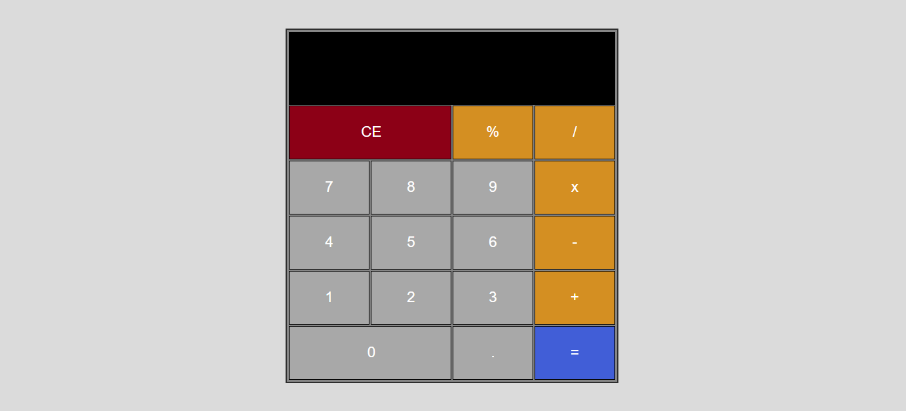

# React Calculator

## Description

A fully functional calculator created using React that supports basic arithmetic (addition, subtraction, multiplication, division, and modulus operation). This was merely for practice as I was familiarizing myself with React. The calculations were done using the mathjs library from [https://mathjs.org/](https://mathjs.org/)

